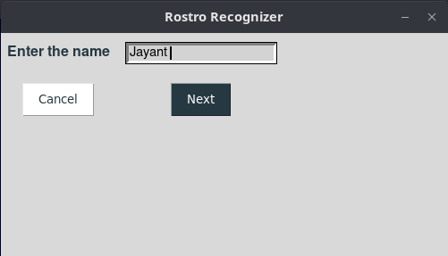
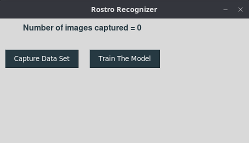
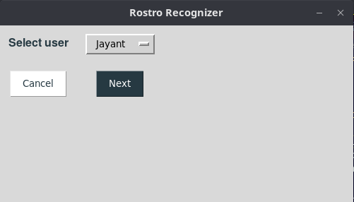

# [Rostro] Face Recogniton AI App

<br/>

# Inroduction

  - This is a very simple Face Recognition/Detection app with the GUI interface. 
  - Here are some features of this app:
    - Its collects and store the data of Face of a person
    - Builds a Face Classifier on the basis of the data collected
    - It uses the classifier to detect the face of the person
    - It also has a emotion detection feature

<br/>

# Installation Guide

## Create A Virutal Environment

1 - Install the **VirutalEnv** python package if not already installed

```
pip install virutalenv
```

2 - Create a new virtual environment

```
virtualenv env
```

3 - Activate the environment

```
source env/bin/activate
```

<br/>

## Install The Requirements

```
pip install -r requirements.txt
```

<br/>

## Exexcute/Run The Application

```
python main.py
```

<br/>

# Screenshots

&nbsp; | &nbsp;
:-------------------------:|:-------------------------:
  |  
  |  
